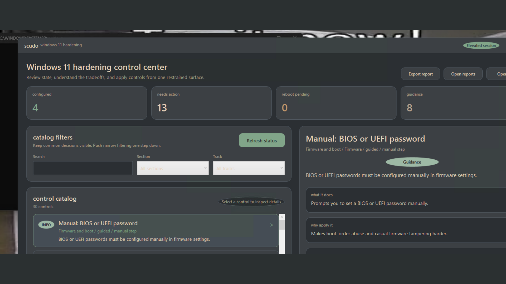

<div align="center">
  

  <h1>scudo</h1>

  <p><strong>windows 11 hardening with a simple menu, direct actions, and rollback-aware guidance</strong></p>

  <p>
    
    
    
    
    
  </p>
</div>

<p align="center">
  
</p>

`scudo` is a hardener, not a debloater. it takes the usual windows 11 hardening steps, puts them behind a dead-simple menu, and keeps the tradeoffs visible so you can decide what to apply instead of blindly flipping every switch.

## quick start

### method 1 - powershell

open powershell, paste this, and press enter:

```powershell
irm https://raw.githubusercontent.com/Microck/scudo/main/get.ps1 | iex
```

if raw github is blocked on the current network, try:

```powershell
iex (curl.exe -fsSL --doh-url https://1.1.1.1/dns-query https://raw.githubusercontent.com/Microck/scudo/main/get.ps1 | Out-String)
```

the bootstrap downloads the current repo into `%localappdata%\scudo` and opens the cli menu immediately.

### method 2 - local clone

```powershell
git clone https://github.com/Microck/scudo.git
cd scudo
.\scudo.cmd --cli
```

## what you get

- a simple numbered menu instead of a pile of scripts
- direct commands for checks, presets, and single-control actions
- a WPF gui with the same control catalog and rationale
- rollback snapshots for the settings that scudo can safely restore
- optional app installs for bitwarden, helium, firefox, and simplewall

## command surface

```text
scudo
scudo --check-all
scudo --preset baseline
scudo --preset strict
scudo --show <control-id|preset>
scudo --export
scudo --gui
scudo --cli
scudo --version
scudo --help
```

if you want the graphical surface instead of the menu, use `scudo --gui`.

advanced:

```text
scudo --action apply --control-id <id>
scudo --action rollback --control-id <id>
scudo --no-pause
```

## menu

```text
[1] review this pc
[2] apply baseline hardening
[3] apply strict hardening
[4] guided hardening walkthrough
[5] browse individual controls
[6] optional apps and browser tools
[7] roll back a saved change
[8] export report
[0] exit
```

## presets

### baseline

use this first. it keeps the higher-value, lower-friction controls together.

baseline currently focuses on:

- control flow guard
- memory integrity
- vulnerable driver blocklist
- telemetry reduction
- remote registry disable

### strict

use this if you are willing to accept more breakage and more tuning work.

strict adds:

- defender asr rules
- quad9 dns
- dns over https
- print spooler disable
- new device install restriction
- firefox noscript policy
- firefox shutdown sanitization
- simplewall filtering when simplewall is already installed

### guided

guided mode walks the catalog section by section and keeps the manual items visible instead of hiding them.

## controls

### firmware and boot

- `bios-password`
  what it does: reminds you to set a bios or uefi password manually.
  why apply it: makes boot-order abuse and casual firmware tampering harder.
  why skip it: forgetting a firmware password is painful.
- `secure-boot`
  what it does: checks whether secure boot is on.
  why apply it: raises the bar for bootkits and untrusted early boot code.
  why skip it: custom boot setups may intentionally leave it off.
- `kernel-dma-protection`
  what it does: checks whether windows reports kernel dma protection.
  why apply it: matters on systems exposed to thunderbolt or similar direct-memory-capable ports.
  why skip it: some platforms simply do not support it.
- `firmware.reboot-to-uefi`
  what it does: reboots directly into firmware settings.
  why apply it: gives you a fast path to review secure boot and related protections.
  why skip it: disruptive, and the actual setting changes are still manual.

### windows protections

- `mitigation.control-flow-guard`
  what it does: turns on system-level control flow guard checks.
  why apply it: makes control-flow hijacking harder.
  why skip it: rare legacy software can rely on weaker mitigation behavior.
- `vbs.memory-integrity`
  what it does: enables memory integrity.
  why apply it: isolates kernel integrity decisions and blocks a large class of low-level tampering.
  why skip it: can cost performance and expose bad old drivers.
- `driver-blocklist`
  what it does: enables microsoft's vulnerable driver blocklist.
  why apply it: stops known-bad signed drivers from being reused by attackers.
  why skip it: old hardware or niche software can depend on outdated drivers.
- `privacy.telemetry-policy`
  what it does: reduces windows diagnostic data policy.
  why apply it: cuts background telemetry without disabling core protections.
  why skip it: support-heavy or managed environments may want fuller diagnostics.
- `privacy.telemetry-services`
  what it does: disables selected telemetry-related services.
  why apply it: removes background services many personal systems do not need.
  why skip it: can reduce troubleshooting visibility.
- `service.remote-registry.disabled`
  what it does: disables remote registry.
  why apply it: removes an unnecessary remote administration surface.
  why skip it: some remote-management workflows still need it.
- `service.print-spooler.disabled`
  what it does: disables print spooler.
  why apply it: reduces attack surface on machines that do not print.
  why skip it: you lose printing until you restore it.

### microsoft defender

- `defender.asr.office-child-process`
  what it does: blocks office apps from launching child processes.
  why apply it: cuts off a common document and macro execution path.
  why skip it: can break unusual office automations and internal templates.
- `defender.asr.obfuscated-scripts`
  what it does: blocks script content that looks intentionally obfuscated.
  why apply it: targets common droppers, loaders, and script abuse patterns.
  why skip it: can interfere with custom admin scripts or vendor tooling.
- `defender.asr.email-executable-content`
  what it does: blocks executable content launched from email paths.
  why apply it: reduces the chance that a phishing attachment gets to run.
  why skip it: some environments still deliver legitimate installers through email.

### network

- `dns.quad9`
  what it does: points active physical adapters at quad9.
  why apply it: adds a resolver that blocks known malicious domains.
  why skip it: can conflict with vpn, split-dns, or managed network setups.
- `dns.doh`
  what it does: enables dns over https for the configured resolver.
  why apply it: adds privacy and integrity to dns lookups.
  why skip it: can interfere with captive portals or enterprise filtering.
- `app.simplewall-enable-filtering`
  what it does: enables simplewall filtering if simplewall is installed.
  why apply it: gives you explicit outbound filtering instead of silent default allow.
  why skip it: outbound filtering needs tuning or it will break apps.
- `simplewall-guidance`
  what it does: explains where outbound filtering helps and what simplewall adds.
  why apply it: useful if you want app-level network control.
  why skip it: there is real maintenance overhead.

### physical access

- `device-install.restrict-new-devices`
  what it does: blocks installation of newly attached devices unless another policy allows them.
  why apply it: helps against quick rogue-usb attacks.
  why skip it: makes normal hardware changes more annoying.
- `public-usb-guidance`
  what it does: explains public charging and hostile usb-device risk.
  why apply it: useful if the machine leaves trusted desks often.
  why skip it: this is operator awareness, not a universal windows setting.

### browser

- `browser-hardening`
  what it does: explains the browser hardening model behind hardened profiles, cookie clearing, and script restriction.
  why apply it: the browser is the biggest practical attack surface on most personal windows systems.
  why skip it: stronger browser hardening always trades away convenience.
- `browser.firefox-noscript`
  what it does: force-installs noscript in firefox through policy.
  why apply it: gives you high-friction but high-value script restriction.
  why skip it: many sites break until you allow what should run.
- `browser.firefox-sanitize`
  what it does: clears cookies and selected site data on firefox shutdown.
  why apply it: reduces stale sessions and persistent tracking data.
  why skip it: you lose persistent logins and some convenience.

### identity and accounts

- `password-manager`
  what it does: explains the password-manager step if you do not want scudo to install one.
  why apply it: unique long passwords are still one of the highest-value identity upgrades.
  why skip it: you may already use a password manager you trust.
- `account.standard-user`
  what it does: explains why daily work should happen under a standard account.
  why apply it: malware running as a standard user is far less dangerous than malware running as admin.
  why skip it: it adds friction if the machine is mostly used for admin work.
- `account.create-standard-user`
  what it does: creates a standard local user for daily work.
  why apply it: least privilege is still one of the strongest containment controls on windows.
  why skip it: you need to manage a second account and tolerate elevation prompts.

### optional apps

- `app.bitwarden`
  what it does: installs bitwarden through winget.
  why apply it: low-friction password-manager path.
  why skip it: only useful if you actually want bitwarden.
- `app.simplewall`
  what it does: installs simplewall through winget.
  why apply it: provides the outbound filtering tool used by scudo's optional network path.
  why skip it: adds another network control plane to maintain.
- `app.helium`
  what it does: installs helium browser through winget.
  why apply it: gives you an alternate browser path if you do not want your main browser to stay stock.
  why skip it: scudo does not currently apply browser policy automation to helium.
- `app.firefox`
  what it does: installs firefox through winget.
  why apply it: unlocks the firefox-specific policy controls that scudo can automate.
  why skip it: only useful if you actually want firefox installed.

## reports

`scudo --export` writes both markdown and json reports.

each report includes:

- state
- section
- tier
- automation level
- rollback note
- what the control does
- why you might apply it
- why you might skip it

## notes

- scudo only supports windows 11.
- some settings are check-only or guided because windows cannot safely automate firmware decisions.
- rollback exists only where scudo captures enough state to restore the prior setting.
- dns and outbound-filtering changes should be tested on the machine and network you actually use.
